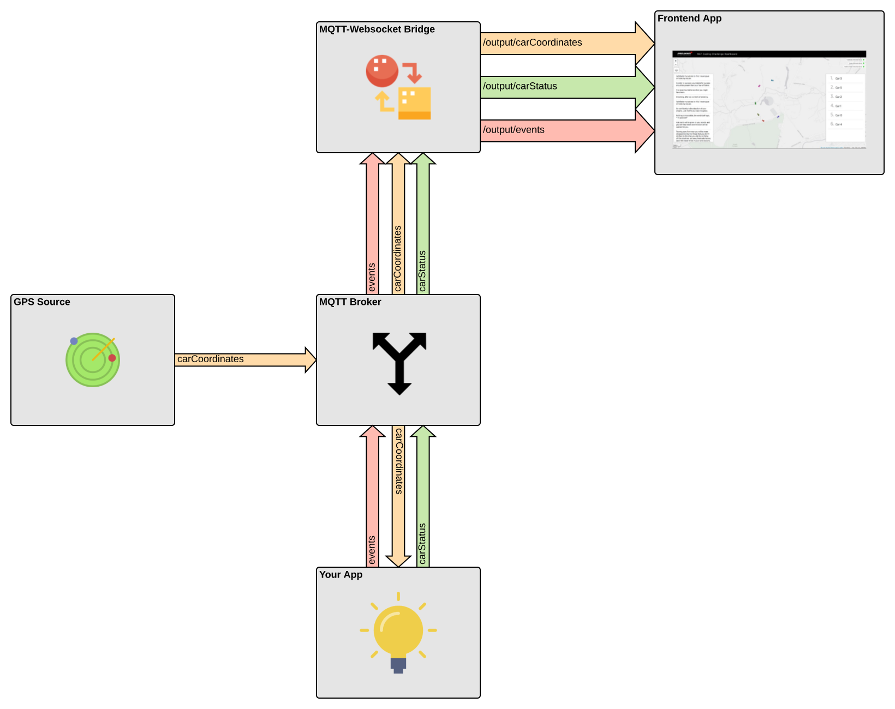

# MAT Fan Engagement Coding Challenge

## Prerequisites:

* [docker](https://docs.docker.com/)
* [docker-compose](https://docs.docker.com/compose/)

## Introduction

The purpose of this challenge is for you to demonstrate
* write and structure a simple backend application in an appropriate language of your choice
* parse and transform streamed telemetry data
* deliver a component to integrate into a stack of technologies

Feel free to use any libraries, frameworks or dependencies you want in order to achieve the task.

Please include instructions on how to build and run your code, any tests you've written and some text explaining what you did.

If you are already familiar with the underlying technologies we hope that it won't take you more than a couple of hours to get your application up and running.

## Scenario

Real-time data from a Formula 1 race has been recorded and streamed into our system. We want to use that data in order to increase fan engagement by providing a live visualisation.

## Challenge

Raw telemetry data is arriving via MQTT. A basic front-end application has been developed to visualise F1 cars going around a track. It can also display an event stream and car status information such as speed and position, but currently it is not receiving this information.

Please develop a data processing application which subscribes to the provided MQTT broker and consumes data from the following MQTT topic with the format shown:

* **carCoordinates**

    ```console
      {
        timestamp: number,
        carIndex: number,
        location: {
          lat: float,
          long: float
         }
      }
    ```

  e.g.

    ```json
      {
        "timestamp": 1541693114862,
        "carIndex": 2,
        "location": {
          "lat": 51.349937311969725,
          "long": -0.544958142167281
         }
      }
    ```

It should then publish aggregated and enriched data on the following MQTT topics using the format described:

- **carStatus**

    ```console
      {
        timestamp: number,
        carIndex: number,
        type: string<SPEED|POSITION>,
        value: number
      }
    ```

  e.g.

    ```json
      {
        "timestamp": 1541693114862,
        "carIndex": 2,
        "type": "POSITION",
        "value": 1
      }
    ```

- **events**

    ```console
      {
        timestamp: number,
        text: string
      }
    ```

  e.g.

    ```json
      {
        "timestamp": 1541693114862,
        "text": "Car 2 races ahead of Car 4 in a dramatic overtake."
      }
    ```

All these topics will then be forwarded via a gateway-like MQTT-to-WebSocket service to the frontend application.

## Architecture



## Getting started

Start all components:

```console
$ docker-compose pull
$ docker-compose up -d
Creating network "mat-coding-challenge_default" with the default driver
Creating broker ... done
Creating source_gps        ... done
Creating mqtt-to-websocket ... done
Creating webapp            ... done
```

Open (http://localhost:8084)

Test the setup with `mosquitto_pub` or a similar MQTT client:

```console
$ mosquitto_pub -t events -f examples/event.json
$ mosquitto_pub -t carStatus -f examples/status.json
```

You should now see a car's position and an event in the webapp.


### Solution

#### Prerequisites:

* [docker](https://docs.docker.com/)
* [docker-compose](https://docs.docker.com/compose/)
* [python3](https://www.python.org/downloads/)

The code represents a module for the Data Processor to be integrated to the current architecture.
It is a MQTT Client that interacts with the broker and subscribes to two topics in order to exchange messages.  

The code is formatted using [Blank]((https://github.com/ambv/black)).

To run the solution clone the project and run the following command from inside the repo:

 ```console
$ ./run-solution.sh
```
This command will install requirements and start the MQTT client from terminal connecting to the existing broker. \

Open (http://localhost:8084)

When the application is stopped, make sure to run:

 ```console
$ docker container stop $(docker ps -a -q)
```

In summary it is a working PoC without any heavy structures. \
When the client receives the messages from the broker, it parses them and calculate the velocity of each car between two successive timestamps,
assuming (once looked at the data) that the messages arrive in a round-robin fashion:in the stream of events we have the information
about all the cars every X milliseconds. We assume that in every interval it is not possible that one car info is missing.  
To determine the positions of the cars, we consider the total distance covered by each car at every interval and
the client then generates the message events according to the positions. \
An external data storage can be added.

To run the tests:
```console
$ docker-compose up -d
$ pytest tests
```
 